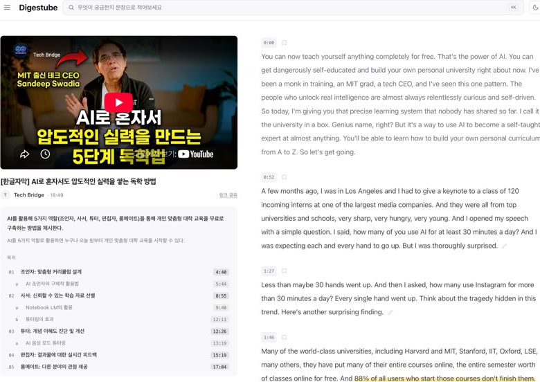
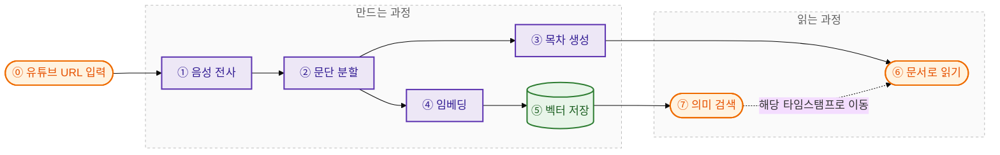

# Digestube

YouTube 영상을 글로 바꿔 읽는 Digestube를 소개합니다!

[](https://digestube.vercel.app)

**[▶ Digestube로 이동하기](https://digestube.vercel.app)**

나중에 본다고 저장만 해두고 결국 안 보는 영상, 많지 않으신가요?

Reader's Digest가 긴 글에서 핵심을 골라냈듯, Digestube는 유튜브 영상을 책처럼 읽을 수 있게 목차와 전사문으로 정리합니다. 일상어로 질문하면 관련 문단을 찾아주고, 누르면 영상의 그 타임스탬프에서 바로 재생됩니다.

***서비스명은 요약을 뜻하는 Digest와 유튜브를 뜻하는 Tube의 합성어입니다.***

## 목차

- [어떻게 돌아가나요?](#어떻게-돌아가나요)
- [지금은 이렇게 정했습니다](#지금은-이렇게-정했습니다)
- [왜 그렇게 정했나요?](#왜-그렇게-정했나요)
  - [A. 전사](#a-전사)
  - [B. 문단과 목차](#b-문단과-목차)
    - [문단 분할](#문단-분할)
    - [목차 생성](#목차-생성)
  - [C. 검색](#c-검색)
    - [임베딩](#임베딩)
    - [벡터 저장](#벡터-저장)
    - [검색 경계](#검색-경계)
    - [순서 다듬기](#순서-다듬기)
  - [D. 운영](#d-운영)
    - [시간 예산](#시간-예산)
    - [실패 원인](#실패-원인)
- [다음에 재볼 것](#다음에-재볼-것)
- [기록과 직접 돌려보기](#기록과-직접-돌려보기)
  - [A. 실험 기록](#a-실험-기록)
  - [B. 로컬 실행](#b-로컬-실행)
  - [C. 저장소 지도](#c-저장소-지도)

## 어떻게 돌아가나요?

Digestube는 유튜브 영상을 글로 옮기고, 읽기 좋게 나눈 뒤, 질문과 뜻이 가까운 대목을 찾아 영상의 그 타임스탬프로 보내줍니다.



현재는 답변을 새로 만들지 않고 관련 문단과 타임스탬프를 반환합니다. 검색 품질과 “답 없음” 판정을 먼저 확정한 뒤, 근거가 연결된 답변 층을 추가할 계획입니다.

| 구간 | 사용한 것 |
|---|---|
| 입력·화면·API | `TypeScript` `Next.js 16` `React 19` |
| 전사·문단·목차 | `Gemini 3.8 Flash` |
| 의미 검색 | `KURE-v1` `pgvector` |
| 데이터 | `PostgreSQL` `Supabase` |
| 배포·흐름 확인 | `Vercel` `Playwright` |

## 지금은 이렇게 정했습니다

지금 서비스에 반영한 선택을 먼저 보여드립니다. 각 선택의 근거와 검증 범위는 바로 다음 장에서 이어집니다.

| 영역 | 현재 결정 | 근거 |
|---|---|---|
| 전사 | 유튜브 주소를 직접 받는 Gemini 3.8 Flash를 기본값으로 사용하고 공급자는 교체 가능하게 유지 | [A. 전사](#a-전사) |
| 문단 분할 | 모델은 화제 경계만 고르고 코드는 원문을 보존하며, 실패하면 문장 경계 방식으로 복귀 | [B. 문단과 목차](#b-문단과-목차) |
| 목차 | 전사문 전체에서 목차를 만들고 각 제목의 근거 인용문을 원문과 대조 | [B. 문단과 목차](#b-문단과-목차) |
| 임베딩 | 개발 비교에서 교체 조건을 충족한 후보가 없어 KURE-v1 유지 | [C. 검색](#c-검색) |
| 벡터 저장 | 문단·타임스탬프·벡터를 Postgres 한 행에 저장하고 pgvector로 검색 | [C. 검색](#c-검색) |
| 검색 | 질문과 의미가 가까운 상위 3개 문단을 타임스탬프와 함께 반환하고 커트라인은 적용하지 않음 | [C. 검색](#c-검색) |
| 검색 순서 | 벡터 결과를 먼저 보여준 뒤 교차 인코더로 다시 매긴 순서를 이어서 보내고, 5초 안에 못 오면 원래 순서 유지 | [순서 다듬기](#순서-다듬기) |
| 목차 갱신 | 재생성할 때 한 트랜잭션에서 전체를 교체해 옛 항목이 남지 않게 함 | [목차 생성](#목차-생성) |
| 시간·실패 | 라우트마다 마감 시각을 정해 남은 시간을 호출에 넘기고, 실패했을 때만 원인을 기록 | [D. 운영](#d-운영) |

## 왜 그렇게 정했나요?

만들면서 가장 오래 붙잡은 문제는 AI가 만든 전사·목차·검색 결과를 어디까지 믿을 것인가였습니다. 아래 수치는 선택을 점검하려고 개발 단계에서 잰 값이며 서비스 전체의 성능을 보증하지 않습니다.

### A. 전사

**배포 환경에서도 유튜브 주소 하나로 전사할 수 있고, 뒤 단계가 사용할 문장과 타임스탬프를 안정적으로 돌려주는 경로가 필요했습니다.**

로컬에서는 네 가지 오디오 추출 후보 중 yt-dlp, 세 가지 전사 후보 중 CER 4.14%를 기록한 Whisper를 골랐습니다. 그러나 배포 서버가 유튜브 접근을 차단당하면서 이 조합을 그대로 운영할 수 없었습니다. Tor·주거용 IP·로그인 쿠키 우회도 안정적인 경로가 되지 못해 유튜브 접근 자체를 대신하는 서비스로 방향을 바꿨습니다.

Supadata의 두 경로도 각각 문제가 있었습니다.

| 경로 | 확인한 문제 |
|---|---|
| `native` | 구두점이 없는 영상과 30~162초가 한 덩어리인 자막 때문에 문장 경계와 타임스탬프를 신뢰하기 어려움 |
| `generate` | 동기 요청이 127초 뒤 524로 끝나며 세 번 연속 실패 |

Gemini API는 유튜브 URL을 직접 받고 구두점과 타임스탬프가 있는 전사문을 반환했습니다. **측정 전에 일곱 기준을 문서로 먼저 적었습니다.** 실행, 문장 끝, 타임스탬프 파싱·정합, 누락, 혼입, 처리 시간. 그다음 당시 `gemini-3.5-flash`를 한국어 영상 6편에 적용했습니다.

| 확인 항목 | 개발 검증 결과 |
|---|---|
| 실행·문장 끝·타임스탬프 파싱·누락·혼입·처리 시간 | 6편 모두 기준 통과 |
| 기존 자막과 직접 비교할 수 있었던 타임스탬프 정합 | 4편 통과 |
| 기존 자막이 기준선으로 부적합했던 2편 | 3.5와 3.6 결과의 타임스탬프 차이 중앙값 0초·0.6초, 개발 판정 통과 |

일곱 기준 중 타임스탬프 정합 하나는 **실행 중에 정의를 바꿨고 사유를 기록했습니다.** 영상 끝이 음악뿐인 경우, 마지막 타임스탬프만 비교하면 말이 끝난 지점에서 멈춘 정상 결과가 미달로 나왔습니다. 전 구간 매칭률과 차이 중앙값으로 바꾸되 통과선 자체는 결과를 보기 전에 정한 값을 유지했습니다. 같은 회사의 두 모델로 교차 확인했으므로 사람 검수를 대체하는 최종 근거로 보지는 않았습니다.

비용도 같이 쟀습니다. 같은 6.9분 영상의 실측 토큰에 당시 공시 단가를 적용하면 3.5 Flash는 약 \$0.155, 3.8 Flash는 약 \$0.063으로 추정됐습니다. 실제 청구액이 아니라 추정치이고 품질 비교가 끝나지 않아, 비용만으로 모델을 결정하지 않았습니다.

Supadata `generate`는 다음 날 다시 동작했습니다. 임시 라우트에서 90.5초 요청이 통과하면서 실패 원인이 플랫폼 제한이 아니라 코드의 `maxDuration = 60`임을 확인했습니다. 이미 Gemini 경로를 검증한 뒤였으므로 공급자 교체 구조는 유지하고 같은 조건의 재비교 대상으로 남겼습니다.

현재 기본값은 `gemini-3.8-flash`입니다. 위 결과는 3.5에 대한 근거이므로 현재 모델은 같은 일곱 기준과 사람 검수로 다시 확인해야 합니다.

### B. 문단과 목차

**모델에는 구조만 고르게 하고 원문은 코드가 보존합니다. 문단은 검색 단위, 목차는 탐색 지도라는 서로 다른 역할에 맞게 생성합니다.**

#### 문단 분할

고정 길이 방식은 문장 중간을 잘랐고, 문장 경계 방식은 문장을 보존해도 하나의 설명을 뜻과 무관한 길이에서 나눴습니다. 의미 유사도로 경계를 고르는 방식은 기준값이 임베딩 모델과 코퍼스에 묶였습니다. 그래서 모델이 전사 전체를 읽고 화제가 시작되는 발화 번호만 제안하게 했습니다.

8편을 다시 나눠 재봤을 때 문장 경계 방식은 88문단 중 **98.9%**가 문장 끝에서 끝났지만, 고정 길이 방식은 83문단 중 **14.5%**뿐이었습니다. 다만 이 수치는 문장 끝 보존율이지 화제 완결성이 아닙니다. 문장은 지켜져도 하나의 설명이 뜻과 무관한 길이에서 갈리는 문제는 그대로 남았고, 그래서 화제 경계로 옮겼습니다.

코드는 범위 밖 번호와 중복을 정리한 뒤 해당 위치에서 원문을 나눕니다. 모델 호출·파싱이 실패하거나 결과가 비었거나 원문 보존 검사에 실패하면 문장 경계 방식으로 되돌립니다. 분할 프롬프트는 결과와 사용자 피드백을 보며 조정했으므로 사전에 고정한 조건이 아닙니다. 원문 보존은 코드와 테스트로 확인했지만, 어떤 모델의 경계가 더 읽기 좋은지는 사람 평가가 남아 있습니다. 모델 분할과 폴백의 구분도 DB에 저장하지 않아 현재 코퍼스의 폴백 빈도를 사후 집계할 수 없습니다.

#### 목차 생성

초기에는 문단 하나에 제목 하나를 붙였습니다. 검색 단위인 문단 수만큼 목차가 생겨 8분 영상에 16개가 나오고 비슷한 제목이 이어졌습니다. 현재는 전사문 전체를 한 번에 보고 보통 4~8개의 주요 목차를 만듭니다.

제목과 함께 근거 인용문을 받고, 인용문이 원문에 없거나 같은 문단을 중복해서 가리키면 해당 항목을 버립니다. 유효한 항목이 2개 미만이거나 전체 생성이 실패할 때만 문단별 방식으로 내려가며, 이 경로에서도 인용 검증에 실패하면 원문 첫 문장을 제목으로 사용합니다.

과거 문단별 방식에서는 **자동 통과 조건과 선정 순서를 먼저 고정한 뒤** 같은 12문단과 프롬프트로 Claude Sonnet 5와 Gemini 3.8 Flash를 각각 두 번 실행했습니다. 두 후보 모두 자동 검사 24/24를 통과했고, 사전에 정한 순차 규칙에서는 흔들림이 10회인 Gemini가 11회인 Sonnet보다 앞섰습니다. 다만 자동 검사는 제목의 의미 품질을 평가하지 못했고 이후 생성 구조도 전체 전사문 방식으로 바뀌어, 이 결과를 현재 모델 선정 근거로 사용하지 않았습니다.

현재 자동으로 확인하는 것은 제목 길이와 인용문의 원문 포함 여부입니다.

**목차를 다시 만들면 옛 항목이 남았습니다.** 저장 함수가 문단 번호 기준 upsert만 하고 새 목록에 없는 옛 행을 지우지 않았기 때문입니다. 목차를 붙이는 기준 문단을 바꾸자 번호가 달라진 옛 행이 충돌하지 않고 그대로 남았습니다. 한 영상은 목차 13개 중 6개가 같은 대목을 가리켰고, 사용자는 4분 45초 항목이 5분 39초로 이동하는 것으로 이를 발견했습니다. 지금은 한 트랜잭션에서 전체를 지우고 다시 넣습니다. 네 영상에서 10·9·13·12개였던 목차가 7·7·7·6개로 정리됐고, 같은 호출을 반복해도 결과가 같은 것과 전사·문단 데이터가 그대로인 것을 확인했습니다.

목차는 요약이 아니라 탐색 도구이므로, NN/G의 정보 냄새 원칙을 바탕으로 **제목만 보고 내용을 예상할 수 있어야 한다**고 정의했습니다. 자동 검사를 통과한 "떠나는 배에 올라타라" 같은 제목은 인용문이 원문과 연결돼도 탐색에는 도움이 되지 않습니다. 핵심 명사 앞배치와 은유 금지를 다음 평가 기준에 추가했습니다.

### C. 검색

**질문과 뜻이 가까운 원문을 먼저 안정적으로 찾은 뒤 답변 생성을 얹기로 했습니다. 임베딩, 저장 방식, 커트라인을 분리해 판단했습니다.**

#### 임베딩

**비교 조건과 교체 기준을 먼저 고정했습니다.** 같은 89문단, 답이 있는 질문 8개, top-3, 커트라인 없음, 1024차원 코사인 유사도. 교체 조건은 KURE-v1의 hit@3를 잃지 않으면서 정답 순위를 개선할 것.

| 모델 | hit@3 | 정답 1위 | MRR |
|---|---:|---:|---:|
| **KURE-v1** | **8/8** | **4/8** | **0.729** |
| BGE-M3 | 7/8 | 3/8 | 0.594 |

BGE-M3는 한 질문의 정답 구간을 4위로 내려 교체 조건을 충족하지 못했습니다. 그래서 KURE-v1을 유지했습니다. 재사용한 질문과 현재 주제 청킹 도입 전 코퍼스로 수행한 개발 비교이므로, 새 질문과 현재 코퍼스에서 다시 확인해야 합니다.

#### 벡터 저장

검색 결과에는 본문과 타임스탬프가 함께 필요하고, 재청킹으로 문단이 사라지면 벡터도 함께 정리되어야 합니다. 별도 벡터 DB를 두는 대신 Postgres 한 행에 문단·타임스탬프·벡터를 저장해 조회와 갱신을 한 곳에서 끝냈습니다.

현재 코퍼스에서는 pgvector의 코사인 전수 검색을 사용합니다. HNSW 색인은 스키마에 후보로만 남겼으며, 어느 문단 수부터 이득인지 측정한 뒤 적용할 계획입니다.

#### 검색 경계

검색 기준선은 8편·89문단, 사용자 검수 질문 10개, top-3, 커트라인 없이 측정했습니다.

| 항목 | 결과 |
|---|---:|
| 시간 구간 자동 적중 | 8/8 |
| AI 본문 1차 판정에서 완전 적중 | 7/8 |
| 부분 적중 | 1/8 |
| 올바른 거절 | 0/2 |

답이 있는 질문의 1위 점수는 0.545~0.667, 답이 없는 질문은 0.544와 0.619였습니다. 두 분포가 겹쳐 가능한 경계값을 적용해도 전체 정답 수가 8/10보다 높아지지 않았습니다. 무관 질문을 거를 만큼 올리면 정상 질문도 놓치기 때문에 임의의 커트라인을 적용하지 않았습니다.

첫 검색은 17.342초, 이후 9건은 중앙값 1.765초였습니다. 첫 요청이 느린 원인은 확정하지 않았습니다. 결과 문단에서는 질문과 가까운 문장을 강조하되, 맥락 없이 의미를 전달하기 어려운 20자 미만 문장은 제외합니다. 20자는 측정으로 확정한 기준이 아니라 관찰을 바탕으로 둔 휴리스틱입니다.

다음 평가를 위한 골든셋 초안은 답 있음 22개와 답 없음 8개, dev/test 각 15개로 만들었습니다. 모두 사람 검수 전인 `draft`이며 현재 문단 경계를 본 상태에서 질문을 만든 편향이 있어 입력 방식을 고친 뒤 다시 생성해야 합니다.

#### 순서 다듬기

**후보는 찾아오는데 순서가 어긋났습니다. 찾기 문제가 아니라 순위 문제임을 먼저 확인하고 리랭커를 얹었습니다.**

4편·101문단, 사용자가 검수한 질문 12개(답 있음 8, 답 없음 4), top-3. 재고 싶은 것을 먼저 적었습니다: 질문마다 **반드시 나와야 할 근거 문단**을 미리 정해두고, 그것이 top-3 안에 들어왔는지로 채점합니다. 기준을 고정한 뒤에 측정했고, 점수를 올리려고 질문이나 정답을 바꾸지 않았습니다.

| | 필수 근거 top-3 | 충분 | 일부 | 못 찾음 |
|---|---:|---:|---:|---:|
| 벡터만 | 6/17 (35%) | 2 | 3 | 3 |
| **리랭커 적용** | **8/17 (47%)** | 3 | 4 | 1 |

후보를 20개까지 넓히면 필요한 문단의 94%(16/17)가 이미 후보 안에 있었습니다. 검색이 못 찾는 게 아니라 순서를 잘못 매기고 있었습니다. 틀린 질문들은 1위와 10위의 점수 차가 0.015밖에 되지 않았고, 한 주제만 다루는 영상에서는 도입부와 정리 문단이 어떤 질문에도 비슷하게 가까워지는 현상이 보였습니다.

교차 인코더 `Dongjin-kr/ko-reranker`로 상위 10개를 다시 매겨 47%가 됐습니다. 실험 결과가 운영 배포본에서 문항별로 그대로 재현됐습니다. 다만 여전히 절반이 안 되고, 질문을 만들 때 문단 경계를 본 편향이 남은 개발 반복입니다.

**느려지는 비용은 화면에서 풀었습니다.** 리랭킹은 운영 12문항 중앙값 3.5초(1.9~4.3초)가 더 걸립니다. 기다리게 하는 대신 벡터 결과를 먼저 보여주고, 다듬은 순서가 도착하면 자리를 옮깁니다. 5초 안에 오지 않으면 원래 순서를 유지합니다. 처음 정한 3초였다면 12개 중 7개가 잘렸을 것이라 실측 뒤 5초로 올렸습니다. 사용자가 이미 스크롤하거나 결과를 누르는 중이면 순서를 바꾸지 않고 "더 관련 있는 순서로 보기" 버튼으로 선택권을 넘깁니다.

### D. 운영

**만드는 과정이 실패했을 때 무엇이 왜 실패했는지 남지 않는 것이 가장 큰 문제였습니다.**

#### 시간 예산

라우트마다 상한(`maxDuration`)이 있는데 안쪽 모델 호출의 타임아웃이 그보다 길게 잡혀 있었습니다. 폴백을 만들어 두고도 라우트가 먼저 끊겨 폴백이 실행되지 못했습니다. 지금은 라우트가 시작할 때 마감 시각을 정하고 남은 시간을 호출마다 넘깁니다. 목차는 55초 중 전체 생성에 35초를 쓰고 남으면 문단별 폴백으로, 등록은 290초 중 25초를 저장 몫으로 남깁니다. 2초도 안 남으면 모델을 부르지 않고 바로 폴백합니다.

#### 실패 원인

실패한 영상에 `상태=실패`만 남아 원인을 알 수 없었습니다. 지금은 실패했을 때만 `video.last_failure`에 단계·종류(timeout/overloaded/quota/http/network/error)·상태 코드·메시지·시각을 남기고, 성공하면 비웁니다. 메시지는 키·토큰을 가린 뒤 200자로 자릅니다. 정상 동작 중에는 아무것도 쓰지 않습니다.

## 다음에 재볼 것

*마지막 갱신 2026-09-21.* 위에서부터 먼저 할 순서입니다.

| 순서 | 영역 | 다음 검증 | 완료 기준 |
|:---:|---|---|---|
| 1 | 검색 | 문단 경계를 보지 않고 질문을 다시 만들어 골든셋을 고정하고, dev에서 커트라인과 리랭커 조건을 정한 뒤 test에 한 번 적용 | 고정 데이터의 필수 근거 적중률·MRR·거절 성능 확정 |
| 2 | 문단·목차 | 후보 경계를 사람이 비교하고, 전체 전사문 목차를 핵심 일치·구체성·탐색성·비중복성으로 채점 | 모델 선정, 통과선과 회귀 사례 확보 |
| 3 | 답변 | 검색 품질과 "답 없음" 판정 확정 후 문장마다 근거 각주를 붙이는 답변 층 추가 | 문장별 근거 존재율과 답변 관련성 측정 |
| 4 | 운영 | 쌓인 `last_failure` 기록으로 단계별 지연 분포와 실패 유형을 집계 | 주요 실패 유형과 지연 분포 확보 |
| 5 | 전사 | 현재 기본값 3.8과 Supadata를 같은 6편·일곱 기준으로 실행하고 사람이 18구간 검수 | 현재 실행 모델의 유지 또는 교체 근거 확정 |
| 6 | 저장 | 문단 수를 늘려가며 전수 비교와 HNSW 검색 시간이 갈리는 지점 측정 | 색인 도입 기준 문단 수 확정 |

## 기록과 직접 돌려보기

### A. 실험 기록

- 전체 기록: [실험·판단 기록](notes/) · [평가 실행 산출물](web/data/evals/)
- 전사: [3.5 Flash 개발 검증](notes/22-transcription-gemini.md) · [현재 후보 재비교 설계](notes/26-transcription-model-compare.md)
- 구조화: [주제 청킹 실행](notes/28-topic-chunking-run1.md) · [과거 문단별 목차 비교](web/data/evals/outline-models/2026-09-13T09-31-32-868Z/summary.json)
- 목차 제목 기준 근거: [NN/G Information Scent](https://www.nngroup.com/articles/information-scent/) · [NN/G Headings Are Pick-Up Lines](https://www.nngroup.com/articles/headings-pickup-lines/)
- 검색 순서: [채점 기준 사전 등록](web/evals/search/config.json) · [벡터 대 리랭커 비교](web/evals/search/runs/2026-09-19T04-17-41-379Z-compare.md) · [운영 배포본 재현](web/evals/search/runs/2026-09-19T06-20-04-740Z.report.md)
- 검색: [KURE-v1·BGE-M3 개발 비교](notes/21-embedding-shortlist.md) · [검색 기준선 해석](web/data/evals/search/runs/2026-09-11T08-10-06-812Z-dev/analysis.md) · [현재 코퍼스와 골든셋 상태](notes/29-goldenset-and-db-cleanup.md)

### B. 로컬 실행

Node.js 22 이상을 권장합니다.

```sh
cd web
npm ci
cp .env.local.example .env.local
npm run dev
```

필수 환경변수는 `GEMINI_API_KEY`, `SUPABASE_URL`, `SUPABASE_SERVICE_ROLE_KEY`, `HF_TOKEN`입니다. Supadata 전사 경로에는 `SUPADATA_API_KEY`와 `TRANSCRIPT_PROVIDER=supadata`, Anthropic 문단별 목차 경로에는 `ANTHROPIC_API_KEY`와 `OUTLINE_PROVIDER=anthropic`을 함께 설정합니다. Supabase 준비 방법은 [`web/README.md`](web/README.md)를 따릅니다.

```sh
npm test
npm run lint
npm run build
npx playwright test
```

단위·DB 테스트 47개는 외부 모델을 부르지 않고 실행됩니다. 브라우저 테스트 10개 중 라이브러리·상세·타임스탬프는 설정된 DB의 저장 영상을 사용합니다.

### C. 저장소 지도

```text
web/src/lib/transcript-provider.ts   전사 공급자 분기 (gemini | supadata)
web/src/lib/topic-chunker.ts         주제 경계 분할과 문장 경계 폴백
web/src/lib/outline-whole.ts         전체 전사문 목차 생성과 인용 검증
web/src/lib/outline.ts               문단별 목차 보조 경로
web/src/lib/embed.ts                 KURE-v1 임베딩
web/src/lib/search.ts                pgvector 유사도 검색
web/src/lib/rerank.ts                교차 인코더 재순위와 폴백
web/src/lib/deadline.ts              라우트 마감 시각 기반 시간 예산
web/src/lib/failure.ts               실패 원인 분류와 비밀값 가리기
web/scripts/                         평가·비교 도구
web/evals/search/                    검색·리랭커 평가 도구와 실행 기록
web/data/evals/                      평가 실행 결과와 산출물
web/tests/                           단위·DB·브라우저 테스트 57개
notes/                               실험·판단 기록
```
