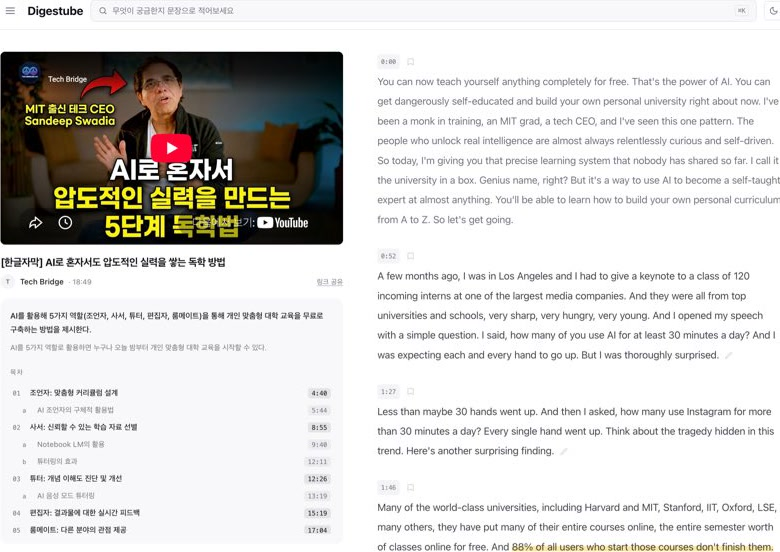
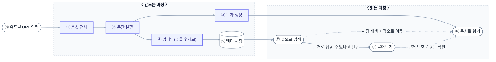

[](https://digestube.vercel.app)

**[▶ Digestube로 이동하기](https://digestube.vercel.app)**

**Digestube는 긴 유튜브 영상을 글로 읽고, 질문으로 필요한 대목을 다시 찾는 서비스입니다.** 자기계발 영상을 저장만 하고 다시 찾아보지 못하던 불편에서 시작했습니다.

AI 부트캠프에서 직접 주제를 정해 시작한 개인 프로젝트로, 기획부터 화면·서버·DB·배포까지 맡았습니다. 과정이 끝난 뒤에도 제가 쓰기 위해 개선하고 있습니다. AI에 구현을 맡기면서도, 평가 질문과 정답 검수·기술 선택·최종 채택 판단은 직접 진행하고 있습니다.


```mermaid
%%{init: {'theme':'base','themeVariables':{'primaryColor':'#FFFFFF','primaryBorderColor':'#64748B','primaryTextColor':'#1F2937','lineColor':'#94A3B8','edgeLabelBackground':'#F8FAFC','clusterBkg':'#F8FAFC','clusterBorder':'#CBD5E1'},'flowchart':{'nodeSpacing':40,'rankSpacing':50,'padding':12,'curve':'basis'}}}%%
flowchart LR
    A([⓪ 유튜브 URL 입력])

    subgraph P ["`**〈 만드는 과정 〉**`"]
        direction LR
        B[① 음성 전사]:::ai
        C[② 문단 분할]:::ai
        D[③ 목차 생성]:::ai
        H["④ 임베딩(뜻을 숫자로)"]:::ai
        E[(⑤ 벡터 저장)]
    end

    subgraph U ["`**〈 읽는 과정 〉**`"]
        direction LR
        F([⑥ 문서로 읽기])
        G([⑦ 뜻으로 검색])
        I([⑧ 물어보기])
    end


    A --> B --> C
    C --> D --> F
    C --> H --> E --> G
    G -.->|해당 재생 시각으로 이동| F
    G -->|근거로 답할 수 있다고 판단| I
    I -.->|근거 번호로 원문 확인| F

    linkStyle default stroke:#94A3B8,stroke-width:1.5px
    classDef ai fill:#EEF2FF,stroke:#6366F1,stroke-width:1.5px,color:#312E81
    style P fill:#F8FAFC,stroke:#CBD5E1,stroke-dasharray:4 4,color:#0F172A
    style U fill:#F8FAFC,stroke:#CBD5E1,stroke-dasharray:4 4,color:#0F172A
```

<p align="center"></p>

- **만드는 과정 (①~⑤):** 유튜브 주소를 넣으면 받아쓰고, 문단과 목차를 만들고, 검색에 쓰도록 문단의 뜻을 숫자로 바꿔 저장합니다.
- **읽기 (⑥):** 목차·전사문·영상 재생 시각을 연결해 필요한 대목으로 이동합니다.
- **검색 (⑦):** 질문하면 저장한 영상에서 관련 문단을 찾고, 그 문단으로 답할 수 있는지부터 판단합니다. 답할 수 없으면 "찾지 못했어요"라고 답합니다. 직접 만든 평가 질문 15개에서 이 판단을 14개 맞혔고, 영상에 답이 없는 질문 4개에는 모두 답하지 않았습니다. [확인 방법](#2-검색과-답변-찾은-문단에-실제-답이-있는지-확인하기)
- **물어보기 (⑧):** 답할 수 있으면 찾은 문단 3개만 근거로 AI가 답을 쓰고, 문장마다 근거 번호를 붙여 원문으로 돌아갈 수 있게 합니다.

만들면서 두 가지 문제를 풀어야 했습니다. 배포 서버에서는 유튜브 음성을 받을 수 없어 전사 방법부터 다시 정해야 했고, 질문과 비슷한 문단을 찾아도 정작 답은 없는 경우가 있었습니다. 아래에는 이 문제를 해결하며 바꾼 방법과 확인한 결과를 정리했습니다.

***서비스명은 요약을 뜻하는 Digest와 유튜브를 뜻하는 Tube의 합성어입니다.***

## 목차 <!-- omit from toc -->

- [어떻게 돌아가나요?](#어떻게-돌아가나요)
- [왜 그렇게 정했나요?](#왜-그렇게-정했나요)
  - [1. Gemini 전사문: 문장부호와 재생 시각이 맞는 전사문 만들기](#1-gemini-전사문-문장부호와-재생-시각이-맞는-전사문-만들기)
  - [2. 검색과 답변: 찾은 문단에 실제 답이 있는지 확인하기](#2-검색과-답변-찾은-문단에-실제-답이-있는지-확인하기)
    - [답할 수 있는지 판단하기](#답할-수-있는지-판단하기)
    - [물어보기](#물어보기)
- [자세한 검증과 한계](#자세한-검증과-한계)
- [다음에 재볼 것](#다음에-재볼-것)
- [로컬 실행](#로컬-실행)
- [저장소 구조](#저장소-구조)

## 어떻게 돌아가나요?

맨 위 흐름도의 단계마다 쓴 기술과 처리 방식입니다.

| 단계 | 사용 기술 | 처리 방식 |
|---|---|---|
| 전사 | Gemini 3.8 Flash | 유튜브 영상을 재생 시각이 붙은 글로 변환 |
| 문단·목차 | Gemini 3.8 Flash | 화제가 바뀌는 곳에서 문단을 나누고, 전사문 전체에서 주요 목차 생성 |
| 검색 | KURE-v1 · pgvector · ko-reranker | 문단·영상 제목·목차에서 후보를 찾고 질문에 맞는 순서로 정렬 |
| 물어보기 | 리랭커 점수 · Gemini 3.8 Flash | 답할 수 있는지 판단하고, 상위 3개 문단을 근거로 답변 생성 |

**고른 이유**

- **전사:** 로컬 Whisper(배포 서버에서 유튜브 차단), Supadata(문장부호 없음·연결 끊김), 더 싼 Gemini 모델(점검 기준 미달이거나 직접 들어 보니 덜 정확)과 비교해 선택 ([사례 1](#1-gemini-전사문-문장부호와-재생-시각이-맞는-전사문-만들기))
- **문단·목차:** Claude Sonnet 5와 원문 인용 검사가 24/24로 동률이었고, Anthropic 크레딧이 떨어져 전사와 같은 Gemini로 통일
- **검색:** 임베딩은 BGE-M3와 비교해 정답을 1위에 둔 횟수가 7/8 대 6/8. 리랭커는 없을 때보다 필요한 근거가 상위 3개에 든 수가 6/17 → 8/17
- **물어보기:** 점수만 쓰는 방식(12~13/15), AI만 쓰는 방식(13/15)과 비교해 답을 보여 줄지 가장 잘 고름(14/15). AI는 점수가 애매할 때만 불러 15개 중 6개만 호출 ([사례 2](#2-검색과-답변-찾은-문단에-실제-답이-있는지-확인하기))

서비스를 이루는 나머지 기술입니다.

| 영역 | 사용 기술 |
|---|---|
| 화면·API | TypeScript · Next.js 16 · React 19 |
| 데이터 저장 | Supabase · PostgreSQL(pgvector) |
| 배포 | Vercel (서울 지역) |
| 테스트 | 단위·DB 테스트(node:test) · 사용자 흐름 테스트(Playwright) |

**고른 이유**

- **데이터 저장:** 별도 벡터 DB를 두면 문단 저장소와 둘로 나뉘어, 한 행에 문단·재생 시각·벡터를 함께 저장. 같은 Postgres 서비스인 Neon은 서울 지역이 없어 Supabase 선택
- **배포:** 긴 전사 요청 때문에 유료 요금제·다른 실행 환경을 후보로 뒀지만, 무료 요금제에서도 요청 하나를 최대 300초까지 실행할 수 있음을 확인해 유지

## 왜 그렇게 정했나요?

개발 중 설계를 바꾼 두 가지 사례입니다. TL;DR에서 선택과 결과를 먼저 보여주고, 본문에서 문제를 발견한 과정과 대안을 비교한 근거를 설명합니다. 수치는 함께 적은 영상·질문에서 측정한 결과입니다.

### 1. Gemini 전사문: 문장부호와 재생 시각이 맞는 전사문 만들기

> [!NOTE]
> **TL;DR**
>
> - **선택:** Gemini에 유튜브 영상 주소를 넘겨, 문장마다 문장부호와 재생 시각이 붙은 전사문을 받도록 변경
> - **이유:** 배포 서버에서는 유튜브가 음성 다운로드를 막았고, 자막 서비스(Supadata)로 가져온 기존 자막은 문장부호가 없거나 잘못 받아쓴 말이 많았으며, 새로 받아쓰는 기능은 당시 연결이 끊김
> - **확인:** 당시 모델(3.5 Flash)로 한국어 영상 6편을 받아써, 미리 정한 7가지 점검(문장부호로 끝나는지, 재생 시각이 영상과 맞는지, 빠진 말이 크게 없는지 등)을 모두 통과
> - **포기한 것:** 더 낮은 비용. 음성 파일만 넘기는 방식은 재생 시각 비교에서 2편이 기준에 못 미쳤고, 더 싼 모델은 점검을 통과해도 직접 들어 보니 잘못 받아쓴 말이 더 많아 채택하지 않음
> - **남은 일:** 사람이 끝까지 들어 보는 정확도 확인, 현재 모델(3.8 Flash)과 Supadata를 같은 조건으로 다시 비교

**Gemini에 영상 주소를 직접 넘기는 방식을 택했습니다.** 처음에는 내 컴퓨터에서 다운로드 도구 yt-dlp로 유튜브 음성을 받아 음성 인식 모델 Whisper로 받아썼습니다. 같은 방식을 배포 서버에서 실행하자 요청이 차단됐습니다. 시험한 클라우드 환경에서는 서버 주소를 바꿔도 차단이 반복됐고, 가정용 IP를 빌리는 프록시, Tor, 로그인 쿠키로 우회해 봤지만 안정적으로 동작하지 않았습니다. 우리 서버에서 음성을 내려받지 않는 경로가 필요했습니다. [서버 수집 검토 기록](notes/06-cloud-ingest.md)

**자막 서비스로는 문단을 나누기 어려웠습니다.** 그래서 유튜브 접근을 대신해 주는 외부 서비스 Supadata를 썼습니다. Supadata에는 두 가지 방식이 있었습니다.

- **영상에 달린 자막 가져오기:** 한국어 영상 6편 중 2편은 문장 끝 문장부호가 하나도 없었고, 한 편은 30~162초의 말이 자막 한 덩어리였습니다. "될성부른 잎"이 "결성 부른 입힌"으로 적히는 등 잘못 받아쓴 말도 많았습니다. 문장이 어디서 끝나는지 모르니 문단을 나누거나, 문단을 눌러 정확한 대목으로 이동하기 어려웠습니다.
- **새로 받아쓰기:** 세 번 모두 약 127초에 Supadata 쪽에서 연결이 끊겼습니다(HTTP 524).

**Gemini에는 영상 주소를 그대로 넘겼습니다.** Gemini API는 [유튜브 주소를 입력으로 받아](https://ai.google.dev/gemini-api/docs/video-understanding) 구글 쪽에서 영상을 읽습니다. 우리 서버가 영상을 내려받지 않으니 차단을 만나지 않습니다. 들리는 말만 문장 단위로 받아쓰고, 문장마다 시작·끝 시각을 붙이고, 화면 글자는 섞지 말라고 지시했습니다. 모델은 화면도 함께 보지만, 그 덕분에 단어가 더 정확해졌는지는 따로 재지 않았습니다.

**긴 영상은 나눠서 받아씁니다.** 서버가 한 번에 300초까지만 실행되므로, 긴 영상은 구간으로 나눠 차례로 받아쓰고 이어 붙입니다. 구간마다 돌아오는 재생 시각이 영상 전체 기준이라 따로 보정하지 않습니다. 85분 영상까지 이 방식으로 처리했습니다. [구간 전사 코드](web/src/lib/gemini.ts)

**받아쓴 결과는 미리 정한 7가지로 점검했습니다.** 기존 자막도 틀린 곳이 있어 정답으로 쓸 수 없으므로, 점수를 매기는 대신 눈에 띄는 실패가 있는지만 봤습니다. 예를 들어 문장이 문장부호로 끝나는지, 같은 말이 기존 자막과 비슷한 시각에 나오는지(재생 시각 비교), 글자 수가 기존 자막의 85% 이상인지(빠진 말) 같은 것입니다. 이 점검은 실패를 걸러낼 뿐, 모든 문장이 정확하다는 증명은 아닙니다. 7가지 전체와 세부 기준은 아래 검증 항목에 있습니다.

당시 모델인 Gemini 3.5 Flash는 한국어 6편 모두 통과했습니다. 재생 시각은 4편에서 기존 자막과 비교했습니다. 기존 자막이 한 덩어리이거나 오인식이 심해 기준으로 쓸 수 없던 2편은 다른 Gemini 모델(3.6)의 결과와 비교했고, 시각 차이 중앙값이 0초·0.6초였습니다. 같은 회사 모델끼리의 비교라 사람 검수를 대신하지는 않습니다. [전사 검증 기록](notes/22-transcription-gemini.md)

**더 싼 방법은 정확도가 떨어져 채택하지 않았습니다.** 현재 기본 모델인 Gemini 3.8 Flash와 비교했습니다.

| 방법 | 비용 | 결과 |
|---|---|---|
| 영상 대신 음성 파일만 넘기기 | 24% 절감 | 6편 중 2편이 재생 시각 비교를 통과하지 못함: 1편은 시각이 밀림(차이 중앙값 7.1초, 기준 5초), 1편은 군말을 더 많이 받아써 기존 자막과 같은 말을 맞춰 볼 수 있는 부분이 너무 적음 |
| 더 싼 모델 3.1 Flash-Lite | — | 6편 중 3편 기준 미달 (2편은 출력 형식이 깨짐) |
| 더 싼 모델 3.5 Flash-Lite | 56% 절감 | 기준은 모두 통과했지만, 두 전사가 다른 구간을 직접 들어 보니 "피가 마리는"(마르는), "헛수가"(헛수고) 같은 오인식이 Lite 쪽에 있음 |

비용 절감률은 비교 가능한 5편의 토큰 수와 당시 단가로 계산한 추정치입니다. 자동 기준을 통과했다고 품질이 같은 것은 아니었습니다. 이번 비교에서는 비용 절감보다 확인된 품질 문제를 피하는 쪽을 택했습니다. [음성만 넘긴 비교](notes/34-audio-only-local.md) · [Flash-Lite 비교](notes/33-flash-lite-transcribe.md)

**나중에 달라진 사실도 있습니다.** Supadata 새로 받아쓰기는 다음 날 다시 작동했습니다(2.7분 영상 69.3초). 또 요청이 60초를 넘으면 배포 서버에서 끊긴다고 봤는데, 이는 요금제 한도가 아니라 코드에 적어 둔 60초 설정이었고 임시 라우트에서 90.5초 요청이 통과했습니다. 그래서 전사 공급자를 설정으로 바꿀 수 있게 두었습니다. 현재 모델(3.8)을 자동 검증 7가지 기준으로 다시 재고 Supadata와 같은 조건에서 비교하는 일은 남아 있습니다. [재비교 설계](notes/26-transcription-model-compare.md)

### 2. 검색과 답변: 찾은 문단에 실제 답이 있는지 확인하기

> [!NOTE]
> **TL;DR**
>
> - **선택:** 문단이 질문에 얼마나 맞는지 매긴 점수(리랭커 점수)가 확실히 높거나 낮으면 점수로, 애매할 때만 AI에게 물어 답을 보여 줄지 정하고, 답에는 원문 근거 번호를 붙임
> - **이유:** 점수만으로는 영상에 답이 없는 질문을 가려내기 어려웠고, AI에게만 맡기면 주제만 비슷한 문단도 근거로 골랐음
> - **확인:** 본시험 15문제에서 답을 보여 줄지 맞게 고른 수가 12개 → 14개로 늘었고, 영상에 답이 없는 질문 4개에는 모두 답하지 않음. 다만 필요한 근거 문단을 찾아낸 수는 늘지 않음
> - **답변 품질:** 답이 있는 질문 11개 중 7개는 답안지의 정답 내용이 답에 들어 있었고, 3개는 일부만, 1개는 답하지 않음(답을 만든 모델과 다른 Claude가 채점)
> - **다음 개선:** 일부만 맞은 3개에서 빠진 두 번째 영상의 근거를 함께 찾기

**검색 점수와 AI 판단을 조합해, 근거가 부족하면 답하지 않도록 했습니다.** 검색은 벡터 검색으로 후보 10개를 찾고(임베딩: 문장의 뜻을 숫자 목록으로 바꿔, 단어가 달라도 뜻이 가까운 문단을 찾는 방식), 질문과 문단을 함께 읽는 리랭커가 순서를 다시 매깁니다. 이때 매긴 점수가 리랭커 점수로, 높을수록 질문에 잘 맞는 문단입니다. 순서가 맞아도 1위 문단에 답이 없을 수 있어서 **필요한 근거를 찾았는지, 그 근거로 답할 수 있는지, 실제 답변이 맞는지**를 따로 쟀습니다.

평가에는 시험지와 답안지 역할을 하는 **질문·정답 30개(골든셋)**를 썼습니다. 저장한 영상 8편을 두고 질문을 직접 만들고, 질문마다 답이 나오는 대목이나 "영상에 답 없음"을 정답으로 적었습니다. 주제만 비슷하고 답은 없는 문단은 "함정 문단"으로 따로 표시했습니다. 15개(dev)는 방법을 고를 때 여러 번 풀어 본 연습 문제이고, 나머지 15개(test)는 방법을 정한 뒤 배포본에서 한 번만 푼 본시험입니다. 연습 문제에만 잘 맞는 방법을 고르지 않으려고 나눴습니다. [평가 질문과 정답](web/data/evals/search/questions.v3.json)

서비스는 질문마다 먼저 "답할 수 있다"(결과와 답을 보여 줌)와 "답할 수 없다"("찾지 못했어요") 중 하나를 고릅니다. 아래 표의 "맞게 고른 수"는 이 선택이 답안지와 같은 질문의 수입니다.

#### 답할 수 있는지 판단하기

| 시도 (연습 문제 15개) | 답을 보여 줄지 맞게 고른 수 | 판단 |
|---|---:|---|
| 리랭커 1위 점수가 -4 미만이면 "찾지 못함" | 12 | 기준선 |
| 상위 3개 점수 평균 | 최대 13 | 잘 맞는 기준값 구간이 좁아 미채택 |
| AI만 판단 | 13 | 주제만 비슷한 함정 문단을 근거로 고른 사례가 있어 단독 사용 안 함 |
| 점수로 먼저 판단, 애매할 때만 AI | 13 | AI 호출 15회 중 4회 |
| **위 방식 + 문단에 영상 정보 추가** | **14** | **채택**, AI 호출 15회 중 6회 |

모든 질문에 AI 판단을 추가하는 대신, 점수만으로 결정하기 어려운 구간에만 호출합니다. 채택한 방식은 연습 문제 15개 중 6개에서 AI를 불렀습니다. 그만큼 응답을 기다리는 비용은 생기므로, 제한 시간 안에 판단이 오지 않으면 점수 기준으로 처리합니다. 세부 기준값은 아래 검증 항목에 정리했습니다. [판단 코드](web/src/lib/judge.ts)

**영상 정보 추가**는 문단만 읽어서는 어느 영상의 무슨 이야기인지 모르는 문제 때문입니다. 예를 들어 "코딩 유튜버"라는 단서가 문단이 아니라 채널명에만 있었습니다. 검색에 쓰는 글에 영상 제목·채널·첫 요약 문장·해당 목차 제목을 붙였고, 화면에는 원문을 그대로 보여줍니다. 저장된 정보라 AI를 추가로 부르지 않습니다. 연습 문제에서 찾아야 할 근거 문단 14개 중 찾아낸 수는 9개 → 10개, 영어 영상의 근거 문단만 보면 4개 중 1개 → 2개로 늘었습니다. 질문을 영어로 번역해 넣는 방법도 비교했지만 변화가 없어 채택하지 않았습니다. [비교 스크립트](web/evals/search/retrieval-variants.py)

| 본시험 15문제 | 이전 방식 (원문, -4 기준) | 현재 방식 |
|---|---:|---:|
| 답을 보여 줄지 맞게 고른 수 | 12/15 | **14/15** |
| 영상에 답이 없는 질문에 답하지 않은 수 | 2/4 | **4/4** |
| 찾아야 할 근거 문단이 상위 3개 안에 든 수 | 11/14 | 11/14 |

마지막 줄의 14는 질문 수가 아니라 근거 문단 수입니다. 답이 있는 질문 11개에 필요한 근거 문단이 모두 14개이고, 여러 영상을 합쳐야 하는 질문은 근거가 둘 이상입니다.

답할 수 있는지는 더 잘 가렸지만, 필요한 근거를 찾은 수는 그대로였습니다. **14/15는 답을 보여 줄지 고른 결과이고, 답의 내용이 맞았는지는 아래 물어보기에서 따로 채점했습니다.** 이전 방식 칸은 최종 채점 뒤 비교용으로 다시 계산했고, 이 계산으로 설정을 바꾸지 않았습니다. [배포본 최종 채점](web/evals/search/runs/2026-09-27T08-24-40-557Z-goldenset-test.json) · [이전 방식 비교](web/evals/search/runs/2026-09-27T17-28-58-retrieval-variants-test.json) · [실행 이력과 지표 설명](web/evals/search/runs/README.md)

#### 물어보기

답할 수 있다고 판단하면 **상위 3개 문단으로 Gemini 3.8 Flash가 3~5문장 답을 만들고**, 문장마다 근거 번호를 붙입니다. 답은 생성되는 대로 화면에 보이고, 번호를 누르면 그 영상의 해당 문단으로 이동해 잠깐 강조되므로 근거를 바로 확인할 수 있습니다. 서버는 문단 번호로 원문을 다시 읽어 모델에 넘기고, 없는 근거 번호는 지웁니다. 근거가 부족하면 답하지 않도록 지시했습니다. [답변 코드](web/src/lib/answer.ts)

답을 만든 Gemini와 다른 **Claude Sonnet 5가, 답안지의 정답 내용이 답에 들어 있는지 자동 채점**했습니다.

| 본시험 15문제 | 결과 |
|---|---|
| 답이 있는 질문 11개 | **맞음 7 · 일부만 맞음 3 · 답하지 않음 1** |
| 영상에 답이 없는 질문 4개 | **4개 모두 답하지 않음** |
| 함정 문단을 근거로 쓴 횟수 | 0건 (연습 문제에서는 1건) |
| 검색 후 답변 완성까지 추가 시간 중앙값 | 약 2.3초 |

일부만 맞은 3개는 모두 여러 영상의 내용을 합쳐야 하는 질문이었고, 두 번째 영상의 근거를 검색하지 못해 답에서도 빠졌습니다. 그래서 다음 개선 대상을 **여러 영상의 근거를 함께 찾는 것**으로 정했습니다. 자동 채점은 답안지와 비교한 것이라, 답의 문장마다 근거와 뜻이 맞는지를 사람이 확인하는 것을 대신하지 않습니다. [채점 스크립트](web/evals/search/ask-eval.py) · [dev 결과](web/evals/search/runs/2026-09-27T17-58-09-ask-dev.json) · [test 결과](web/evals/search/runs/2026-09-27T19-04-20-ask-test.json)

## 자세한 검증과 한계

본문의 선택을 뒷받침한 비교 조건과 운영 기록입니다. 각 항목을 펼치면 측정 범위와 남은 한계를 볼 수 있습니다.

<details>
<summary>전사: 6편 검증 결과와 한계</summary>

당시 모델인 Gemini 3.5 Flash를 한국어 영상 6편에서 확인한 결과입니다. 현재 모델 3.8 Flash 전체에 대한 재검증 결과로 읽지 않도록 구분합니다.

| 자동 확인 항목 | 사용한 기준 |
|---|---|
| 실행 | 오류 없이 정상 종료 |
| 문장부호 | 종결 문장부호가 하나도 없는 영상이 없을 것 |
| 재생 시각 해석 | 시각 해석 실패·역순이 없을 것 |
| 재생 시각 비교 | 같은 말을 대조한 비율 50% 이상, 시각 차이 중앙값 5초 이하 |
| 글자 수 | 기존 자막의 85% 이상 |
| 표기 혼입 | 검사한 대괄호·화자 표시 패턴 0건 |
| 처리 시간 | 영상 길이의 25% 이하 |

문장부호 존재·글자 수·특정 표기 패턴은 자동으로 확인할 수 있는 간접 지표입니다. 모든 문장 경계의 정확성, 발화 누락 여부, 화면 글자 혼입 여부를 완전히 검증하지는 못합니다. 재생 시각도 사람이 정한 정답이 아닌 비교 전사문과 대조했습니다.

| 확인 항목 | 개발 검증 결과 |
|---|---|
| 실행·문장 끝·재생 시각 해석·누락·혼입·처리 시간 | 6편 모두 기준 통과 |
| 기존 자막과 직접 비교할 수 있었던 재생 시각 정합 | 4편 통과 |
| 기존 자막이 기준선으로 부적합했던 2편 | 3.5와 3.6 결과의 재생 시각 차이 중앙값 0초·0.6초, 개발 판정 통과 |

- 재생 시각 정합은 실행 중 정의를 바꾸고 사유를 남겼습니다. 영상 끝이 음악뿐이면 마지막 시각만 비교하는 방식이 정상 전사를 실패로 셌기 때문입니다. 전 구간 매칭률과 시각 차이 중앙값으로 바꾸되, 사전에 정한 통과선은 유지했습니다.
- 자막과 비교하기 어려운 2편은 같은 회사 모델끼리 교차 확인했습니다. 사람 검수를 대신하는 근거로 보지는 않았습니다.
- 같은 6.9분 영상의 실측 토큰에 당시 단가를 적용하면 3.5 Flash는 약 \$0.155, 3.8 Flash는 약 \$0.063이었습니다. 실제 청구액이 아닌 추정치입니다.

</details>

<details>
<summary>운영: 요청 시간, 실패 기록, 하루 사용량 제한</summary>

#### 시간 예산 <!-- omit from toc -->
서버 요청의 제한 시간보다 AI 응답을 기다리는 시간이 길었습니다. 실패했을 때 쓸 대체 처리를 만들어 두고도 서버 요청이 먼저 끊겨 실행되지 못했습니다.

지금은 요청 시작 때 마감 시각을 정하고 각 처리에 남은 시간을 전달합니다. 목차 생성은 전체 55초 중 35초만 첫 시도에 쓰고, 남은 시간에는 문단별 생성을 시도합니다. 영상 등록도 저장 시간을 따로 남겨 둡니다. [시간 관리 코드](web/src/lib/deadline.ts)

#### 실패 원인 <!-- omit from toc -->
실패한 영상에 `상태=실패`만 남아 원인을 알 수 없었습니다. 지금은 실패한 단계·원인·시각을 함께 기록하고, 오류 메시지의 키와 토큰은 가립니다. 재처리가 성공하면 실패 기록을 비웁니다. [실패 기록 코드](web/src/lib/failure.ts)

#### 하루 사용량 제한 <!-- omit from toc -->
로그인 없이도 쓸 수 있어 비용이 한없이 늘지 않도록 하루 사용량을 제한합니다. 전사는 비용이 영상 길이에 비례하므로 편수가 아니라 분으로 셉니다. 한 사람 하루 90분(같은 IP는 합쳐서 270분), 서비스 전체 하루 10시간까지이고, 물어보기는 한 사람 하루 50회입니다. [제한 코드](web/src/lib/limits.ts)

</details>

<details>
<summary>문단·목차: 문단 나누기와 목차 만들기</summary>

#### 문단 분할 <!-- omit from toc -->
글자 수로만 나누면 문장 중간이 잘렸습니다. 문장이 끝나는 곳에서 나누면 이 문제는 줄었지만, 하나의 설명이 여러 문단으로 갈라지는 경우가 남았습니다.

8편을 비교했을 때 문장 끝을 보존한 비율은 고정 길이 방식 **14.5%(83문단)**, 문장 경계 방식 **98.9%(88문단)**였습니다. 이 수치만으로 이야기의 흐름까지 좋다고 볼 수는 없어, AI가 전사문 전체를 읽고 화제가 바뀌는 위치를 고르게 했습니다.

현재는 다음처럼 역할을 나눴습니다.

- **AI:** 전사문 전체를 읽고 화제가 바뀌는 발화 번호만 제안
- **코드:** 잘못된 번호와 중복을 정리하고, 해당 위치에서 원문을 나눔
- **실패 시:** AI 호출이나 결과 해석에 실패하거나 원문이 보존되지 않으면 문장 경계 방식으로 복귀

원문 보존은 코드와 테스트로 확인했습니다. 프롬프트는 결과를 보며 조정했으므로 모델 간 가독성 비교는 사람 평가가 남아 있습니다. 대체 방식의 사용 빈도는 DB에 기록하지 않아 집계하지 못했습니다. [문단 분할 기록](notes/28-topic-chunking-run1.md)

#### 목차 <!-- omit from toc -->
처음에는 검색용 문단(약 340자)마다 AI가 제목을 하나씩 달아 목차로 썼습니다. 앞뒤 맥락 없이 제목을 지으니 비슷한 제목이 반복됐고, 변경 당시 기록으로 8분 영상에 목차가 16개(약 30초마다 하나) 생겼습니다.

책의 목차가 문단 제목을 모은 것이 아니라 전체 내용을 큰 주제로 묶은 것이라는 점에서 방향을 얻어, 전사문 전체를 AI에 한 번에 넘기도록 바꿨습니다. 프롬프트에는 같은 이야기는 한 항목으로 묶고, 개수는 영상의 실제 덩어리 수에 맞추고(보통 4~8개, 억지로 맞추지 않음), 제목은 이야기가 시작되는 문장 앞에 25자 이내로 붙이라고 적었습니다. 변경 당시 같은 영상의 목차는 5~6개가 됐고 AI 호출은 16회에서 1회로 줄었습니다. [목차 프롬프트](web/src/lib/outline-whole.ts)

AI는 항목마다 그 대목의 핵심 문장을 원문에서 그대로 옮겨 적고, 코드는 그 문장이 원문에 글자 그대로 없으면 항목을 버립니다. 같은 문단을 가리키거나 순서가 뒤집힌 항목도 버리고, 전체 생성이 실패하면 문단별 방식으로 되돌립니다. 다만 원문 대조는 제목이 구체적인지까지 보장하지 않아, "떠나는 배에 올라타라"처럼 근거는 있어도 내용을 짐작하기 어려운 제목이 나옵니다.

목차 모델은 Claude Sonnet 5와 Gemini 3.8 Flash가 원문 인용 검사 24/24로 동률이었고, Anthropic 크레딧이 떨어져 전사와 같은 Gemini로 옮겼습니다. [목차 모델 비교 결과](web/data/evals/outline-models/2026-09-13T09-31-32-868Z/summary.json)

목차를 다시 만들 때 옛 항목이 남는 저장 문제도 있었습니다. 한 영상에서는 13개 중 6개가 같은 대목을 가리켰습니다. 전체 목차를 한 번에 교체하도록 바꾸고, 네 영상에서 중복이 정리되며 반복 저장해도 결과가 같음을 확인했습니다.

</details>

<details>
<summary>검색 판단: 평가 질문 구성</summary>

현재는 리랭커 1위 점수가 -2 이상이면 결과를 보여주고, -8 미만이면 "찾지 못했어요"로 답하며, 그 사이만 Gemini에 묻습니다. AI가 3초 안에 답하지 않으면 -3을 기준으로 삼습니다. 기준값은 dev에서 정했으며 정답 확률을 뜻하지 않습니다.

- 한 영상 질문 15개·여러 영상 질문 5개·함정 질문 2개·답 없는 질문 8개
- 함정 질문에는 주제만 비슷하고 답의 근거는 아닌 문단도 표시
- 검색 범위는 영상 8편·89문단. 이전 임베딩 평가와 같은 문단을 쓰던 문항은 제외
- 같은 영상 집합을 사용하므로 새 영상에 대한 성능까지 검증한 것은 아님

</details>

<details>
<summary>검색 기반: 임베딩 모델과 저장소 선택</summary>

#### 임베딩 <!-- omit from toc -->
질문과 문단의 뜻을 비교하는 임베딩 모델은 KURE-v1과 BGE-M3를 비교했습니다. **정답 발견 횟수를 유지하면서 순위도 나아져야 교체한다**는 기준을 먼저 정했습니다. 아래는 전사 방식을 바꾼 뒤 같은 질문 8개·Gemini 전사문 89문단으로 다시 잰 결과입니다(2026-09-22).

| 모델 | 정답이 상위 3개에 포함 | 정답이 1위 |
|---|---:|---:|
| **KURE-v1** | **7/8** | **7/8** |
| BGE-M3 | 7/8 | 6/8 |

두 모델의 발견 횟수는 같았지만 KURE가 정답을 1위에 놓은 횟수에서 앞서 **교체하지 않고 유지했습니다.**

이미 여러 번 사용한 개발 질문 8개의 시간 구간을 자동 채점한 결과입니다. 새로운 질문에서도 KURE가 우세하다는 뜻은 아니며, 채점의 예외 사례와 과거 측정과의 차이는 기록에 남겼습니다. [재측정 기록](notes/32-embedding-refresh.md) · [결과표](web/data/evals/search/runs/2026-09-22T10-30-30-153Z-embedding-refresh/embedding-comparison-2026-09-22/summary.md)

#### 벡터 저장 <!-- omit from toc -->
검색 결과에는 본문과 재생 시각이 함께 필요하고, 재청킹으로 문단이 사라지면 벡터도 함께 정리되어야 합니다. 별도 벡터 DB를 두는 대신 Postgres 한 행에 문단·재생 시각·벡터를 저장해 조회와 갱신을 한 곳에서 끝냈습니다.

현재 코퍼스에서는 pgvector의 코사인 전수 검색을 사용합니다. HNSW 색인은 스키마에 후보로만 남겼으며, 어느 문단 수부터 이득인지 측정한 뒤 적용할 계획입니다.

</details>

<details>
<summary>검색 개선: 리랭커로 순서 다듬기</summary>

#### 순서 다듬기 <!-- omit from toc -->
**찾아온 후보에 필요한 문단이 있어도 상위 결과에는 나오지 않았습니다.** 질문과 후보 문단을 함께 읽고 순위를 다시 매기는 리랭커를 추가해 비교했습니다.

영상 4편·101문단에서 사용자 검수 질문 12개(답 있음 8개·없음 4개)를 평가했습니다. 답이 있는 질문에 필요한 근거 17개를 미리 정하고, 검색 상위 3개에 얼마나 포함되는지 확인했습니다.

| 방식 | 필수 근거가 상위 3개에 포함된 수 |
|---|---:|
| 벡터 검색만 | 6/17 (35%) |
| **리랭커 적용** | **8/17 (47%)** |

후보를 20개까지 보면 필요한 근거 17개 중 16개가 이미 있었습니다. 순위를 개선할 여지가 있다고 보고 상위 10개를 리랭커로 다시 매겼습니다. 배포본에서도 결과를 확인했지만, 여전히 절반에 못 미쳤고 문단을 보며 만든 질문이라는 한계가 남았습니다. [비교 기록](web/evals/search/runs/2026-09-19T04-17-41-379Z-compare.md) · [배포본 확인](web/evals/search/runs/2026-09-19T06-20-04-740Z.report.md)

화면에서는 검색·재정렬·판단이 끝난 결과를 한 번에 보여줍니다. 읽던 결과의 순서가 바뀌지 않게 하고, 기다리는 동안에는 처리 단계를 안내합니다.

대신 기다리는 시간이 늘었습니다. 당시 운영 12문항에서 재정렬에 추가로 걸린 시간은 중앙값 3.5초였습니다. 측정 결과에 맞춰 제한을 3초에서 5초로 늘렸고, 실패하면 벡터 검색 순서를 사용합니다. 이 시간에는 답변 생성이 포함되지 않습니다.

</details>

## 다음에 재볼 것

*마지막 갱신 2026-09-29.* 측정에서 드러난 문제를 기준으로 다음 작업을 정했습니다.

1. **여러 영상의 근거를 함께 찾기** — 본시험에서 일부만 맞은 3개는 두 번째 영상의 근거가 빠진 사례였습니다. 키워드 검색과 벡터 검색을 결합하는 방법 등을 비교하고, 필요한 근거 발견과 답변 완전성이 함께 나아지는지 확인하려 합니다.
2. **이어 묻는 질문 처리하기** — 현재 질문 하나를 평가한 결과만 있습니다. 앞선 대화를 알아야 답할 수 있는 질문을 별도로 만들고, 문맥을 복원하면서도 근거를 연결하는지 확인하려 합니다.
3. **전사와 문단을 사람이 평가하기** — 현재 전사 모델과 Supadata를 같은 조건에서 비교하고, 문단 흐름과 목차 제목의 구체성을 사람이 확인해 자동 검사로 놓치는 품질을 보려 합니다.

운영에서는 실패 기록으로 자주 끊기는 단계를 찾고, 처리 시간은 별도로 측정해야 합니다. 저장 문단이 늘면 전수 검색과 HNSW 색인의 속도를 비교해 색인을 도입할 시점을 정할 계획입니다.

자세한 실험 과정과 결과는 [실험·판단 기록](notes/)에서 확인할 수 있습니다.

## 로컬 실행

Node.js 20.9 이상이 필요합니다(Next.js 16 요구 사항).

```sh
cd web
npm ci
cp .env.local.example .env.local
npm run dev
```

필수 환경변수는 `GEMINI_API_KEY`, `SUPABASE_URL`, `SUPABASE_SERVICE_ROLE_KEY`, `NEXT_PUBLIC_SUPABASE_URL`, `NEXT_PUBLIC_SUPABASE_ANON_KEY`, `HF_TOKEN`입니다. Supadata 전사 경로에는 `SUPADATA_API_KEY`와 `TRANSCRIPT_PROVIDER=supadata`, Anthropic 문단별 목차 경로에는 `ANTHROPIC_API_KEY`와 `OUTLINE_PROVIDER=anthropic`을 함께 설정합니다. Supabase 준비 방법은 [`web/README.md`](web/README.md)를 따릅니다.

```sh
npm test
npm run lint
npm run build
npx playwright test
```

단위·DB 테스트는 외부 모델을 부르지 않고 실행됩니다. 브라우저 테스트 중 라이브러리·상세·재생 시각 점검은 설정된 DB의 저장 영상을 사용합니다.

## 저장소 구조

```text
web/src/app/          화면과 API
web/src/lib/          전사·문단·목차·검색·답변 처리
web/scripts/          데이터 준비와 비교 도구
web/evals/search/     검색·판단·답변 평가와 실행 기록
web/data/evals/       평가 결과
web/tests/            단위·DB·브라우저 테스트
notes/                실험 과정과 기술 선택 기록
```
